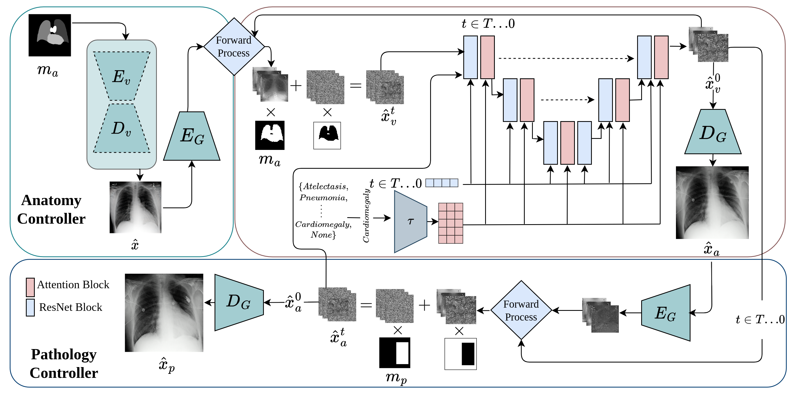

# XReal: Realistic Anatomy and Pathology-Aware X-ray Generation via Controllable Diffusion Model

[Anees Ur Rehman Hashmi](https://github.com/aneesurhashmi),
[Ibrahim Almakky](https://scholar.google.com/citations?user=T9MTcK0AAAAJ&hl=en&oi=sra),
[Mohammad Areeb Qazi](https://scholar.google.com/citations?user=KeyK8FQAAAAJ&hl=en),
[Santosh Sanjeev](https://github.com/santosh9sanjeev?tab=repositories),
[Vijay Ram Papineni](https://ssmc.ae/doctors/dr-vijay-papineni/),
[Dwarikanath Mahapatra](https://scholar.google.com/citations?user=j5K7HPoAAAAJ),
[Mohammad Yaqub](https://scholar.google.com/citations?user=9dfn5GkAAAAJ)


[](https://arxiv.org/abs/2403.09240v1)
<!-- [ -->

> **Abstract:** *Large-scale generative models have demonstrated impressive capacity in producing visually compelling images, with increasing applications in medical imaging. However, they continue to grapple with the challenge of image hallucination and the generation of anatomically inaccurate outputs. These limitations are mainly due to the sole reliance on textual inputs and lack of spatial control over the generated images, hindering the potential usefulness of such models in real-life settings. We present XReal, a novel controllable diffusion model for generating realistic chest X-ray images through precise anatomy and pathology location control. Our lightweight method can seamlessly integrate spatial control in a pre-trained text-to-image diffusion model without fine-tuning, retaining its existing knowledge while enhancing its generation capabilities. XReal outperforms state-of-the-art x-ray diffusion models in quantitative and qualitative metrics while showing 13% and 10% anatomy and pathology realism gain, respectively, based on the expert radiologist evaluation. Our model holds promise for advancing generative models in medical imaging, offering greater precision and adaptability while inviting further exploration in this evolving field.* 


<!-- <hr /> -->

<!-- # :rocket: News
* **(March 15, 2024)**
  * Datasets generated by ObjectCompose on ImageNet and COCO are released.
  * Pre-trained models and evaluation code  is released.
  * Code for ObjectCompose is released.

<hr /> -->


## Contents

1) [Overview](#overview)
2) [Setup](#setup)
3) [Inference](#inference)
4) [Training](#training)
5) [Citation](#citation)
6) [References](#references)

## Overview



## Setup 

1. Clone the repository:
```bash
git clone https://github.com/BioMedIA-MBZUAI/XReal.git
```

2. Install the dependencies using the following command:

 - Python version required: 3.8.5

```bash
pip install -r requirements.txt
```

3. Download the pre-trained models from [here](https://mbzuaiac-my.sharepoint.com/:u:/g/personal/anees_hashmi_mbzuai_ac_ae/ESKGv_LIDm9Cq9bUOsc-JlsB85ha20NyYJ5Wrz1n_4j4kQ?e=5Ru9iE)

4. Extract the downloaded models in the root directory.

5. Clone the required repositories in the src directory:

```bash
mkdir src \

cd src
```

- Clone the chexray-diffusion repository:

```bash
git clone https://github.com/CompVis/taming-transformers.git  \

git clone https://github.com/openai/CLIP.git \

mv ./CLIP ./clip
```


## Inference

Please check the tutorial in this [notebook](notebooks/01_xreal.ipynb).

## Training

- All parameters are defined in the `config.yml` file.

1. To train the XReal T2I backbone:

```shell
cd scripts
python train_t2i_backbone.py -b ../configs/xreal-diff-t2i.yml
```

2. To Train XReal (our):
```shell
cd scripts
python train_vae.py -b ../configs/xreal-ae.yml
``` 

3. To Train ControlNet:

  - First create the skeleton for the controlnet:
```shell
cd cnet
python cnet/tool_add_control.py
```
  - Then train the controlnet:
```shell
python cnet/train_cnet.py -b ../configs/xreal-diff-t2i_cnet.yml
```


## Citation

If you use **xreal** or our repository in your research, please cite our paper *XReal: Realistic Anatomy and Pathology-Aware X-ray Generation via Controllable Diffusion Model*:

```
@article{hashmi2024xreal,
  title={XReal: Realistic Anatomy and Pathology-Aware X-ray Generation via Controllable Diffusion Model},
  author={Hashmi, Anees Ur Rehman and Almakky, Ibrahim and Qazi, Mohammad Areeb and Sanjeev, Santosh and Papineni, Vijay Ram and Mahapatra, Dwarikanath and Yaqub, Mohammad},
  journal={arXiv preprint arXiv:2403.09240},
  year={2024}
}
```

## References

Our code is based on the following repositories:

- [chexray-diffusion](https://github.com/saiboxx/chexray-diffusion)
- [stable-diffusion](https://github.com/CompVis/stable-diffusion/)
- [ControlNet](https://github.com/lllyasviel/ControlNet)
